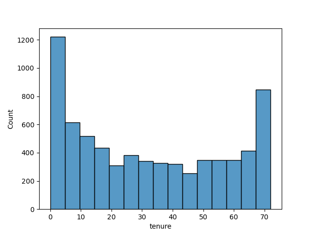
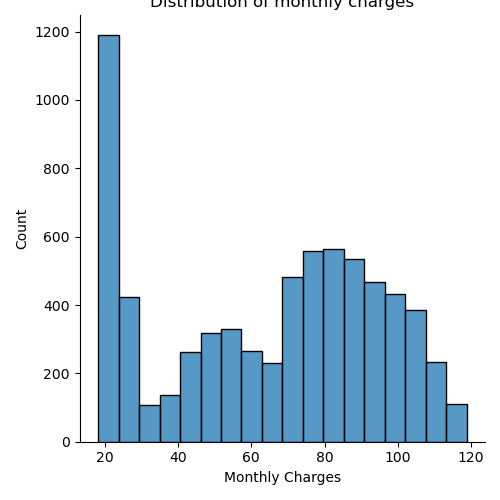
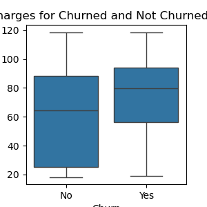
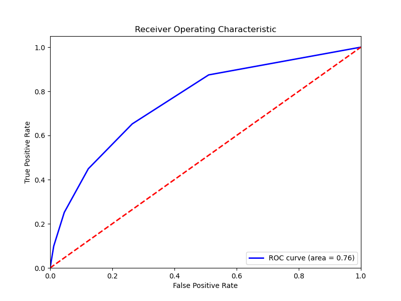
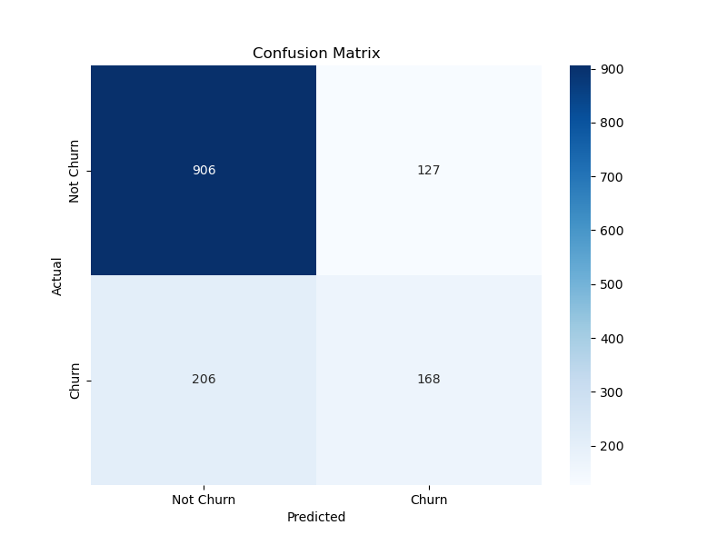

# 📡 Telecom Churn Rate 

## 📘 Introduction

Why do customers leave, and can your business afford to let them slip away?

The telecom industry is fiercely competitive, and one key metric to monitor business health is **churn rate**—the percentage of customers who cancel their service over a given time period. High churn often signals customer dissatisfaction or more appealing competitor offers.

This project aims to uncover the factors driving churn using a dataset from Kaggle and develop models to predict churn with the goal of improving customer retention, reducing acquisition costs, and boosting overall profitability.

---

## 🎯 Problem Statement

**Objective:**  
Help a Switzerland mid-scale wireless service provider reduce customer churn.

**Goals:**  
- Achieve at least **70% accuracy** in predicting customer churn  
- Achieve a **10% decrease** in churn rate by the end of the year

---

## 📊 Data Wrangling

- **Dataset Size:** 7,043 rows × 23 columns  
- **Source:** Kaggle  
- **Handling Missing Values:** Missing values were replaced with the **mean** of their respective columns to maintain consistency and avoid bias.

---

## 🔍 Exploratory Data Analysis (EDA)

EDA focused on identifying trends between customer attributes and churn, especially:

- **Tenure:** Most customers leave within the 1st month or stay beyond 6 years.

- **Senior Citizens:** Represented 83% of the dataset.
- **Contract Types:** Majority (≈55%) opted for **month-to-month** contracts.
- **Churn Rate:** 26% (1,860 out of 7,026 customers), which aligns with industry standards (20–40% annually).

### Key Observations:

- **Monthly Charges:** Most customers pay ~$19–$20.

- **Total Charges:** Higher charges are associated with fewer customers.
- **Churned customers** often have higher average charges than non-churned.

---

## 🤖 Model Selection

### 1. **K-Nearest Neighbors (KNN)**

- Chosen for simplicity and effectiveness on medium-sized datasets
- **Target Variables:** Monthly Charges, Tenure, Churn
- **Test Accuracy:** ✅ **76%**
- **Evaluation Metrics:** ROC Curve & Confusion Matrix

### 2. **Linear Regression**

- Used to understand the relationship between tenure, monthly/total charges, and churn.
- **R² Score:** 0.691  
- **RMSE:** 1266.58  
- Revealed a positive relationship between **tenure** and **total charges**

---

## 📌 Takeaways

- **KNN outperformed Linear Regression**, exceeding the 70% prediction accuracy target.
- Customers with **lower average monthly charges** were less likely to churn.
- **Senior citizens**, being 83% of the customer base, should be prioritized in retention strategies.
- **Month-to-month contracts** correlated with higher churn—indicating flexible plans may need rethinking.

### 📈 Recommendations:

1. Adjust pricing for most popular services (especially those around $20).
2. Launch targeted marketing campaigns for **senior citizens** (by January 2023).
3. Introduce **loyalty programs** for long-term customers, especially those crossing the 1-year and 6-year marks.

---

## 🔬 Future Research

- Tune **KNN hyperparameters** (e.g., optimal `k`, distance metrics)
- Explore **non-linear regression** (polynomial features, Ridge, Lasso)
- Implement advanced ML models like **Random Forests** or **Gradient Boosting** to improve prediction performance and reduce RMSE.

